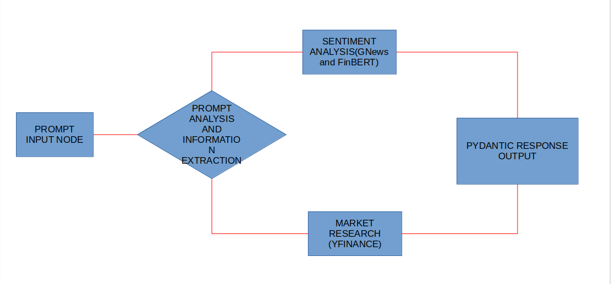

# AGENTIC SECURITY ANALYSIS USING DIFFERENT AGENTIC FRAMEWORKS AND MODEL CONTEXT PROTOCOL
# Graphs and nodes involed - 

# Project Description - 
- This project is a Data Science project based on market research and LLMs.
- The first part of this project is purely based on Postgres based market data series extraction using yfinance and Supabase - 
  - Time series extraction for over 150 listed companies.
  - Daily data extraction scheduled using Apache Airflow DAGs.
  - Calculating market stats - PE ratio, Liquidity, Volumes, 52-week statistics, EPS ratio, etc.
  - Fetching company data - Founders, history, exchange listed on, capital holdings, etc.
  - Alternate method is running a bash script scheduler in the operating system.
  - Supabase used for data warehousing. (PostgreSQL)
 
- The second part of the project is the sentiment analysis for any stock using FinBERT -
  - Uses locally install FinBERT for news classification.
  - Categorizes the market news for that stock and lists all the hot tips from the market.
  - Gives a summary of classified news.
 
- The third part of this project is to perform prompt based tool calling using Autogen and Anthropic MCP -
  - Uses prewritten yfinance based tools for an MCP server.
  - Server processes the prompt and facilitates tool calling using MCP tools.
  - A summary is generated using Claude Sonnet in the terminal for the stock's analysis based on news, stock pricing and different other stock information.
 

## Tools being used for data extraction and cleansing - 
1) yfinance API
2) Supabase docker and API
3) XML files for config and creating tables
4) Autogen 0.4.5 for Agentic Workflows and dynamic function calls.
5) ChatGPT 4o-mini for handling NLP prompts

## LLM operations and RAG - 
1) FinBERT
2) Autogen Agentic Workflow (**securities_project/src/autogen_branch**)
3) Langgraph Nodes and Graphs(**securities_project/src/langsmith_agents**)
4) Model Context Protocol based workflow(**securities_project/src/anthropic_branch**)

## Tools used for scheduling and workflow management- 
1) Apache Airflow
2) Supervisor Autogen Agent for addressing FunctionTool() calls.
